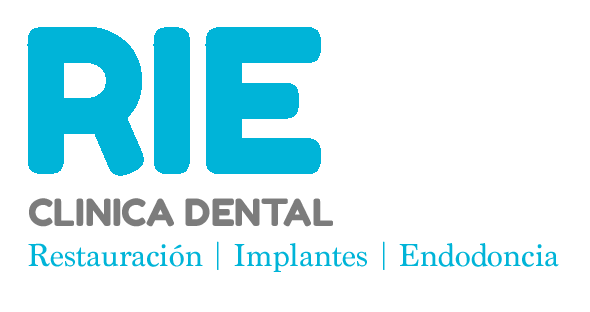

</img>

## Clínica dental RIE

Proyecto individual creado en el curso de Javascript dictado por Coderhouse de una página web que ofrece servicios dentales donde el usuario puede comprar online ingresando a través del usuario y contraseña. Enfocado en el uso de Javascript puro y manejo de funciones, arrays, objetos, métodos y ciclos. Manejo del DOM y JSON. Promesas y funciones asíncronas. Uso de AJAX y Fetch. Implementación de librerías como Bootstrap, Sweetalert y Toastify.cUso de LocalStorage para el registro, inicio de sesión y servicios guardados. El diseño es responsive.

#### Instalación:

Al descargar el repositorio, debes obtener las dependencias con el comando "npm install"

#### Sitio web:

[https://paaolaola.github.io/rie-project/](https://rieclinicadental.netlify.app/)

Los datos son almacenados desde el LocalStorage. No hay bases de datos de por medio. Puedes ingresar registrandote aquí:
https://rieclinicadental.netlify.app/pages/registro

#### Wireframe:

https://excalidraw.com/#json=XUdHxuAuOWVKEkom-4H8t,RfkWG_-5Iq-RAI6LRgB5bA
